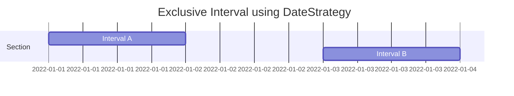
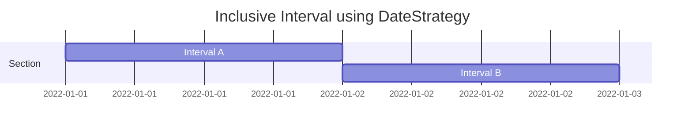

# Overlapping Intervals

A simple library for searching for genereic overlapping intervals.

[](http://commitizen.github.io/cz-cli/) [](https://eslint.org/)

---

## Table of Contents

- [Installation](#installation)
- [Explanation](#explanation)
  - [Intervals](#intervals)
- [Usage](#usage)
  - [Overlaps between two intervals](#overlaps-between-two-intervals)
  - [Overlaps between Arrays or in a single Array](#overlaps-between-arrays-or-in-a-single-array)
- [Custom Implementation](#custom-implementation)
- [Contributing](#contributing)
- [License](#license)

## Installation

To install the package, you can use **npm** or **yarn** or **pnpm**:

```bash
npm i -S overlapping_intervals
```

```bash
yarn add overlapping_intervals
```

```bash
pnpm add overlapping_intervals
```

## Explanation

### Intervals

- [x] Exclusive Intervals



- [x] Inclusive Intervals



### Usage

#### Overlaps between two intervals

You can use the available Strategies or use a custom implementation:

1. **DateStrategy**
2. **NumberStrategy**

```ts
import { DateStrategy, NumberStrategy, isOverlapping } from 'overlapping_intervals';

const areDatesOverlapping = isOverlapping<Date>(
  { start: new Date(2020, 0, 1), end: new Date(2020, 0, 2) },
  { start: new Date(2020, 0, 2) },
  false,
  DateStrategy
);

console.log(areDatesOverlapping); // outputs false

const areNumbersOverlapping = isOverlapping<number>(
  {
    start: 1,
    end: 2,
  },
  {
    start: 1.5,
    end: 3,
  },
  true,
  NumberStrategy
);

console.log(areNumbersOverlapping); // outputs true
```

#### Overlaps between Arrays or in a single Array

You can use the available methods or use a custom implementation:

1. **OverlappingDatesSearch**
2. **OverlappingNumbersSearch**

```ts
import { OverlappingDatesSearch, Interval } from 'overlapping_intervals';

const group1a: Interval<Date>[] = [
  {
    start: new Date('2022-01-01T00:00:00.000Z'),
    end: new Date('2022-01-05T00:00:00.000Z'),
  },
  {
    start: new Date('2022-01-07T00:00:00.000Z'),
    end: new Date('2022-01-08T00:00:00.000Z'),
  },
  {
    start: new Date('2022-01-09T00:00:00.000Z'),
    end: new Date('2022-01-18T00:00:00.000Z'),
  },
];

const group1b: Interval<Date>[] = [{ start: new Date('2019-02-01T00:00:00.000Z') }];

const overlapsBetweenArrays = OverlappingDatesSearch.findOverlaps(group1a, group1b, false);

const overlapsInArrayA = OverlappingDatesSearch.findOverlaps(
  group1a,
  [] /* pass an empty array*/,
  false
); // check overlapsInArrayA[1] for possible overlaps

// returns a tuple [overlaps between A and B, overlaps in array A, overlaps in array B, has any overlap been found]
```

### Custom Implementation

- Strategy

```ts
import { IntervalComparisonStrategy, Interval, isOverlapping } from 'overlapping_intervals';

const isValidNumber = (n?: string): boolean => {
  if (n === undefined && n === null) {
    return false;
  }

  return !Number.isNaN(+(n ?? ''));
};

export class StringIntervalComparisonStrategy implements IntervalComparisonStrategy<string> {
  isOverlapping(a: Interval<string>, b: Interval<string>, exclusive: boolean): boolean {
    const [from1, to1, from2, to2] = [a.start, a.end, b.start, b.end];

    if (!isValidNumber(from1) || !isValidNumber(from2)) {
      throw Error('Please pass valid string numbers in start method');
    }

    if (!exclusive) {
      return (
        (isValidNumber(to2) ? +from1 < +(to2 as string) : true) &&
        (isValidNumber(to1) ? +(to1 as string) > +from2 : true)
      );
    }
    return (
      (isValidNumber(to2) ? +from1 <= +(to2 as string) : true) &&
      (isValidNumber(to1) ? +(to1 as string) >= +from2 : true)
    );
  }
}

// passing the new string strategy enables us to use the isOverlapping Method

export const StringStrategy = new StringIntervalComparisonStrategy();

console.log(
  isOverlapping(
    {
      start: '1',
      end: '3',
    },
    {
      start: '4',
      end: '6',
    },
    false,
    StringStrategy
  )
);
```

- Finding Overlaps in Array

```ts
import { LineSweepOverlapStrategy } from 'overlapping_intervals';

export const stringEndTimesComparison = (a: Interval<string>, b: Interval<string>): number => {
  return +(a?.end ?? `${Number.MAX_SAFE_INTEGER}`) - +(b?.end ?? `${Number.MAX_SAFE_INTEGER}`);
};

export const stringSortFn = (a: Interval<string>, b: Interval<string>): number => {
  return +a.start - +b.start;
};

const OverlappingStringsSearch = new LineSweepOverlapStrategy(
  StringStrategy, // defined in previous example
  stringEndTimesComparison,
  stringSortFn
);

console.log(
  OverlappingStringsSearch.findOverlaps(
    [
      {
        start: '1',
        end: '2',
      },
      {
        start: '2',
        end: '3',
      },
    ],
    [
      {
        start: '4',
        end: '5',
      },
      {
        start: '4.5',
        end: '5.5',
      },
    ],
    false
  )
);

// Outputs [ [], [], [ { start: '4', end: '5' } ], true ] => meaning overlap has been found in B
```

## Contributing

We use Commitizen for standardizing commit messages. Please use `pnpm run cm` instead of `git commit` to commit your changes.

This project also uses ESLint to maintain code quality. Please make sure to run `pnpm run lint` and fix any linting errors before committing your changes.

After your changes are done, create a PR and I'll review and merge your PR <3!

## License

This project is licensed under the MIT License.

---
